<h1 align="center">


</h1>

# Quick shout out to...
<h1 align="left">
  <a href="https://odin-lang.org/">
    
  </a>
</h1>

Credit where credit is due. Odin has been a genuine pleasure to build in, and I am only getting started. I come from a data engineering background, and while I have poked at plenty of other languages, Python has been home for years. This is the first one in a long time that reminded me what "... the Joy of Programming" actually feels like. Here's to you [@gingerBill](https://github.com/gingerBill) and team.

---
A zero-ceremony logging package for Odin.

Colored, aligned console output for humans. JSON Lines on disk for machines. Per-thread output boxes for when a worker pool turns your terminal into confetti. Stack traces on `error` and `fatal`. Log rotation that cleans up after itself. And a one-line bridge to `context.logger`, so a vendored package's output lands in the same place as your own.

> Everything documented here is the **public API**.

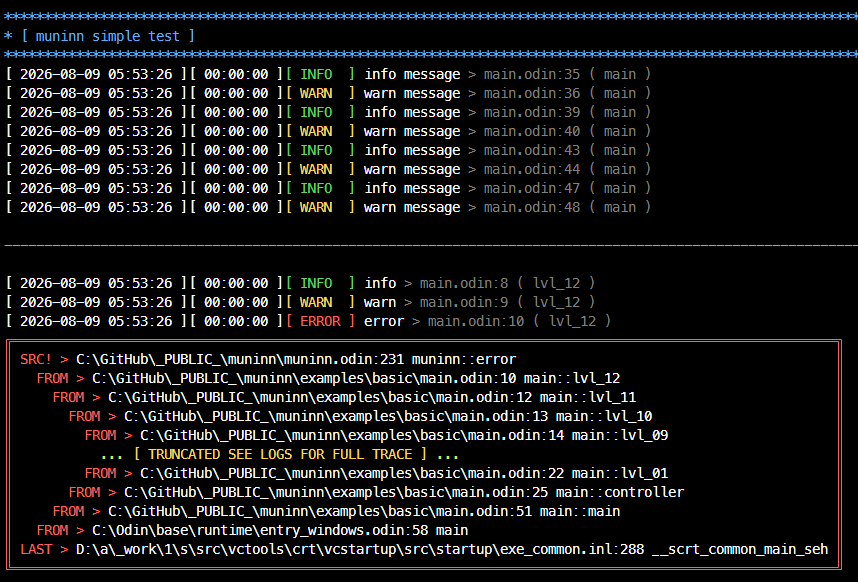
<br clear="left" />

> This is "out of the box". No setup call, no config file, nothing to wire up: `import mn "lib/muninn"` and start logging. Every option ships with a sane default, and `init` is there for the ones you disagree with.

## Contents

- [Quick shout out to...](#quick-shout-out-to)
  - [Contents](#contents)
  - [Install](#install)
  - [Quick start](#quick-start)
  - [API at a glance](#api-at-a-glance)
  - [`init`](#init)
    - [Parameters](#parameters)
    - [Notes](#notes)
    - [Examples](#examples)
  - [Logging procedures](#logging-procedures)
    - [Level filtering](#level-filtering)
    - [`error` and `fatal` behavior](#error-and-fatal-behavior)
  - [`core:log` bridge](#corelog-bridge)
    - [`logger`](#logger)
    - [`hooked`](#hooked)
    - [Attach at the top level of a scope](#attach-at-the-top-level-of-a-scope)
    - [Threads](#threads)
    - [Level mapping](#level-mapping)
    - [Bridge notes](#bridge-notes)
  - [`is_enabled`](#is_enabled)
  - [`reset_ctx`](#reset_ctx)
  - [`flush`](#flush)
  - [`sep`](#sep)
  - [`title`](#title)
  - [`Levels`](#levels)
  - [Color constants](#color-constants)
  - [Thread grouping](#thread-grouping)
  - [JSON output and files](#json-output-and-files)
    - [File naming and rotation](#file-naming-and-rotation)
  - [Environment variables](#environment-variables)
    - [`muninn.verbose.lock`](#muninnverboselock)
  - [Lifecycle and thread safety](#lifecycle-and-thread-safety)
  - [Limits and gotchas](#limits-and-gotchas)

## Install

Drop the package somewhere in your project and import it:

```odin
import mn "libs/muninn"
```

The package has an `@(init)` procedure, so it configures itself the moment your program starts, before `main` runs. On Windows that also flips the console to UTF-8 and enables ANSI escape processing, so the colors and box-drawing characters work in `cmd.exe` and PowerShell without you doing anything.

Stack traces on `error` and `fatal` only exist in debug builds. Compile with `-debug` if you want them.

## Quick start

```odin
package main

import mn "../.."

path := "c/:dev/my_app"
host := "127.0.0.1"
port := 22
delay := 15
err := "This is not good!!!"

main :: proc() {
	mn.init(level = .DEBUG, log_dir = "C:/logs/myapp")

	mn.title("Muninn")

	mn.trace("cache warm: %d entries", 128)
	mn.debug("config loaded from %s", path)
	mn.info("listening on %s:%d", host, port)
	mn.warn("retrying in %v", delay)
	mn.error("connection dropped: %v", err)

	mn.sep(char = "-", color = mn.GRAY)

	// only if you bail out without returning from main
	// mn.flush()
	// os.exit(1)
}
```

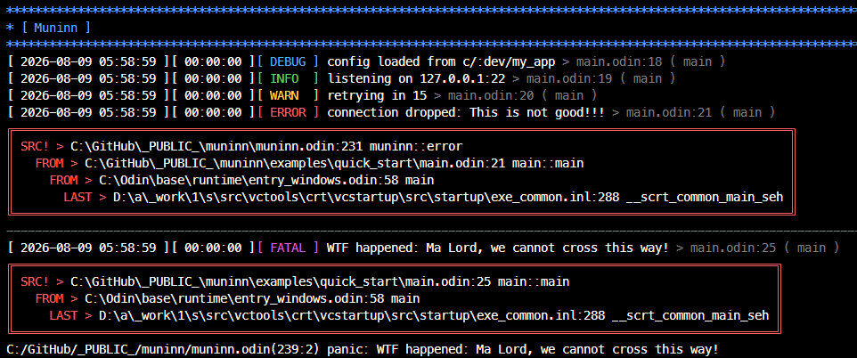
<br clear="left" />

## API at a glance

| Symbol | Kind | Purpose |
| --- | --- | --- |
| `init` | proc | Configure the logger. Every argument is optional. |
| `trace` `debug` `info` `warn` `warning` `error` `fatal` | proc | Emit a log line. |
| `logger` | proc | Muninn packaged as a `runtime.Logger`, for `context.logger`. |
| `hooked` | proc | Whether a given logger is muninn's. |
| `is_enabled` | proc | Cheap check before building expensive log arguments. |
| `reset_ctx` | proc | Close the calling thread's pending output box. |
| `flush` | proc | Force buffered file output to disk. |
| `sep` | proc | Print a full-width separator line to the console. |
| `title` | proc | Print a banner: separator, message, separator. |
| `Levels` | enum | `TRACE`, `DEBUG`, `INFO`, `WARN`, `ERROR`, `FATAL`. |
| `RESET` `GRAY` `BLUE` `GREEN` `YELLOW` `RED` `MAGENTA` `CYAN` | constant | ANSI color codes usable with `sep` and `title`. |

## `init`

```odin
init :: proc(
	level:              Maybe(Levels) = nil,//
	rotate_days:        Maybe(int) = nil,
	//
    show_stack_trace:   Maybe(bool) = nil,
	emit_json:          Maybe(bool) = nil,
	use_color:          Maybe(bool) = nil,
	show_location:      Maybe(bool) = nil,
	short_location:     Maybe(bool) = nil,
	show_runtime:       Maybe(bool) = nil,
	show_timestamp:     Maybe(bool) = nil,
	show_pid:           Maybe(bool) = nil,
	show_tid:           Maybe(bool) = nil,
	//
	group_max_lines:    Maybe(int) = nil,
	group_by_thread:    Maybe(bool) = nil,
	//
	log_dir:            Maybe(string) = nil,
	save_file:          Maybe(bool) = nil,
)
```

Calling `init` is **optional**. The logger works with sane defaults out of the box.

Every parameter is a `Maybe`, so anything you leave off is untouched. Call it once with everything, or call it repeatedly to change one knob at a time.

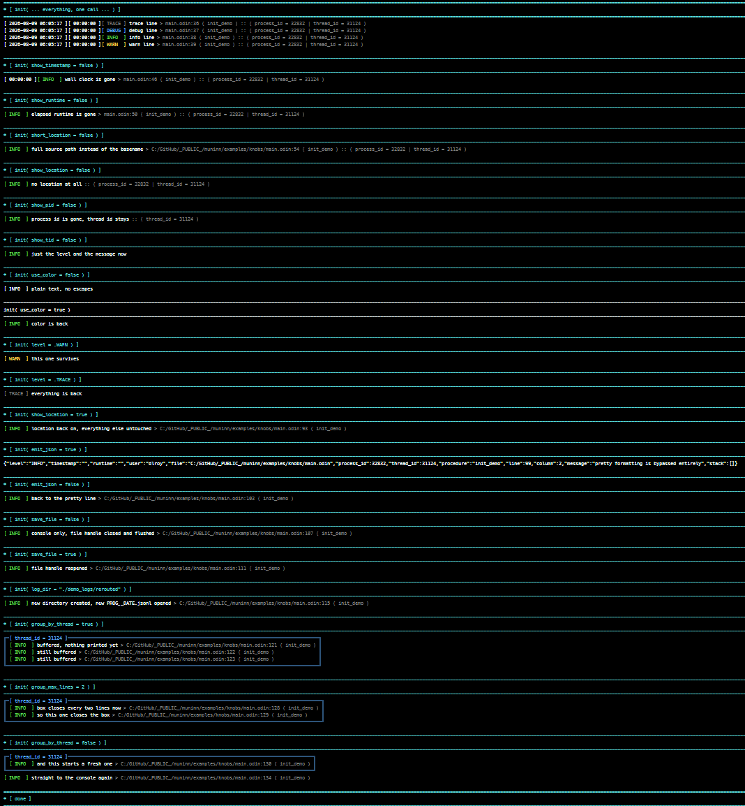
<br clear="left" />

### Parameters

**Output routing**

| Parameter | Type | Default | Description |
| --- | --- | --- | --- |
| `save_file` | `bool` | `true` | Write JSON Lines to disk. Toggling this reopens or closes the file handle immediately and flushes whatever was buffered. |
| `log_dir` | `string` | `<exe dir>/.logs` | Directory for the `.jsonl` files. Changing it rebuilds the filename, creates the directory tree, and reopens the handle. |
| `rotate_days` | `int` | `5` | How many days of logs to keep. Clamped to `>= 0`. Pruning runs at exit. |
| `emit_json` | `bool` | `false` | Print JSON to stdout instead of the pretty line. Overrides all pretty formatting: colors, boxes and grouping are skipped entirely. |

**Verbosity**

| Parameter | Type | Default | Description |
| --- | --- | --- | --- |
| `level` | `Levels` | `.INFO` | Minimum level to emit. Anything below is dropped before the message is even formatted. Stored atomically, so this one is safe to change at runtime from any thread. |

**Pretty formatting** (all ignored when `emit_json` is `true`)

| Parameter | Type | Default | Description |
| --- | --- | --- | --- |
| `use_color` | `bool` | auto | ANSI color. Auto-detected at startup from `NO_COLOR` / `FORCE_COLOR` / `FORCE_NO_COLOR`. Pass this only to override the detection. |
| `show_location` | `bool` | `true` | Append `file:line ( procedure )` to each line. |
| `short_location` | `bool` | `true` | Basename instead of the full path. Requires `show_location`. |
| `show_runtime` | `bool` | `true` | Prepend `[ HH:MM:SS ]` elapsed since process start. |
| `show_timestamp` | `bool` | `true` | Prepend `[ YYYY-MM-DD HH:MM:SS ]` local wall clock. |
| `show_pid` | `bool` | `true` | Append the process id. |
| `show_tid` | `bool` | `true` | Append the thread id. Redundant with `group_by_thread`, since the box label already carries it. |

**Thread grouping** (ignored when `emit_json` is `true`)

| Parameter | Type | Default | Description |
| --- | --- | --- | --- |
| `group_by_thread` | `bool` | `false` | Buffer lines per thread and print each run inside a labeled box instead of interleaving them. Turning it **off** flushes anything still pending. |
| `group_max_lines` | `int` | `50` | How many lines one thread buffers before its box is closed and a fresh one starts. Clamped to `>= 1`. Lower means more responsive output and more boxes. |

### Notes

Call `init` **before you spawn threads**. Every option except `level` is a plain non-atomic global, so reconfiguring while workers are mid-log is a data race.

The file sink is only touched when you pass `log_dir` or `save_file`. Passing formatting options alone never reopens the file.

`use_color` also affects `sep` and `title`, which are not level-filtered and go straight to the console.

### Examples

```odin
// typical: quiet console, everything on disk
mn.init(level = .DEBUG, log_dir = "C:/logs/myapp")

// structured output for a log shipper, no files
mn.init(emit_json = true, save_file = false)

// debugging a thread pool
mn.init(group_by_thread = true, group_max_lines = 25, show_tid = false)

// console only, no files at all
mn.init(save_file = false)

// minimal single-line output
mn.init(show_timestamp = false, show_runtime = false, show_pid = false, show_tid = false)

// bump verbosity later, from anywhere, safely
mn.init(level = .TRACE)
```

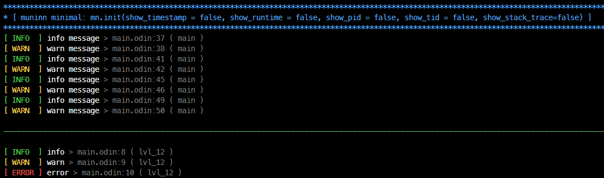
<br clear="left" />

## Logging procedures

```odin
trace   :: proc(msg: string, args: ..any, ctx_reset := false, location := #caller_location)
debug   :: proc(msg: string, args: ..any, ctx_reset := false, location := #caller_location)
info    :: proc(msg: string, args: ..any, ctx_reset := false, location := #caller_location)
warn    :: proc(msg: string, args: ..any, ctx_reset := false, location := #caller_location)
warning :: warn
error   :: proc(msg: string, args: ..any, ctx_reset := false, location := #caller_location)
fatal   :: proc(msg: string, args: ..any, ctx_reset := false, location := #caller_location)
```

| Parameter | Description |
| --- | --- |
| `msg` | The message. When `args` are supplied it is used as a `fmt` format string. With no `args` it is printed verbatim, so stray `%` characters are safe. |
| `args` | Variadic format arguments. |
| `ctx_reset` | Closes the calling thread's pending output box before logging. Runs even if the message is filtered out by the level. No-op unless `group_by_thread` is on. |
| `location` | Source location. Defaults to the call site. Override it when you are wrapping these procs in your own helpers, so the location points at the real caller. |

```odin
mn.info("server started")
mn.info("bound %s:%d after %v", host, port, elapsed)
mn.debug("worker done", ctx_reset = true)
mn.error("write failed: %v", err)
```

`warning` is a straight alias for `warn`.

### Level filtering

A call is dropped when its level is below the configured minimum, before the message is formatted, so unused log calls cost almost nothing.

**`fatal` is not filtered.** It ignores the level entirely and always emits.

### `error` and `fatal` behavior

`error` captures a stack trace and forces an immediate file flush, so an error is on disk even if the process dies right after.

`fatal` does the same, then flushes everything (including all pending thread boxes) and **panics** with the formatted message. It does not return.

Stack traces require a debug build. Without `-debug` the trace is empty and the box is not drawn. In the pretty console box the trace is collapsed to the first five and last five frames with a truncation marker in the middle. The `stack` array in the JSON output is never truncated.


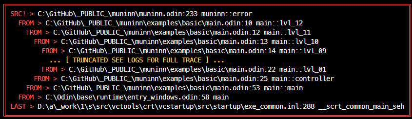
<br clear="left" />


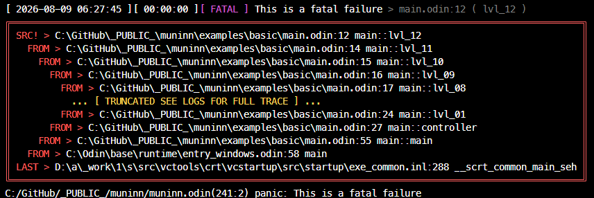
<br clear="left" />

## `core:log` bridge

Third-party packages log through `context.logger`. Point that at muninn and everything they emit joins your own lines: same colors, same `file:line ( procedure )` suffix, same level gate, same `.jsonl`, same thread boxes.

One line, at the top level of `main`:

```odin
context.logger = mn.logger()
```

```odin
package main

import "core:log"
import mn "libs/muninn"

main :: proc() {
	context.logger = mn.logger()

	log.info("a vendored package logging through core:log")
	mn.info("your own call")
	// identical output, identical file, identical everything
}
```

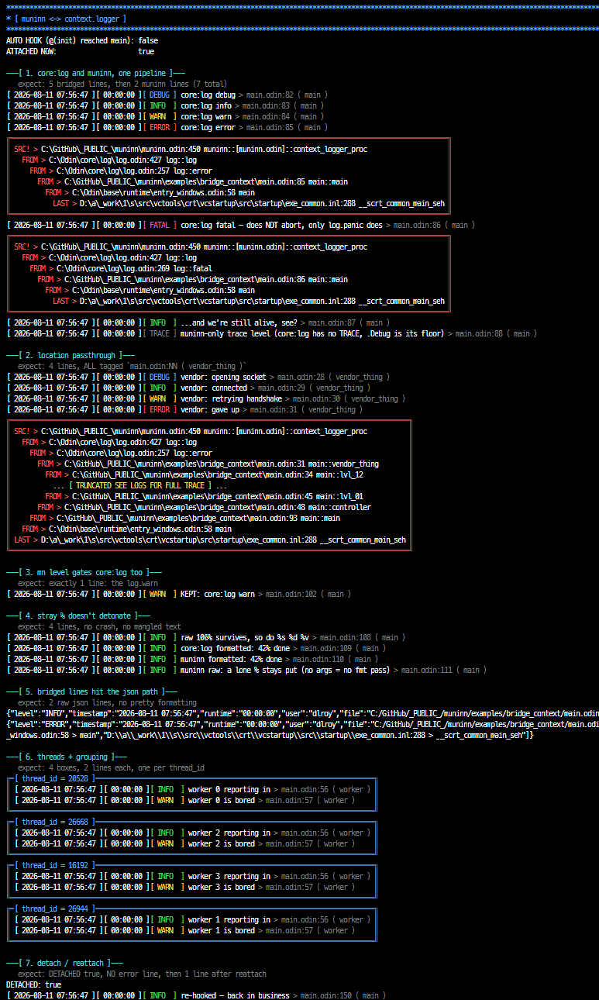
<br clear="left" />

Muninn does attempt to attach itself in its own `@(init)`, but a procedure cannot write another scope's `context` unless your code also opts into `#+feature global-context`. Treat the one-liner as required and use `hooked` if you want to know which happened.

### `logger`

```odin
logger :: proc "contextless" (lowest: runtime.Logger_Level = .Debug) -> runtime.Logger
```

Returns muninn as a plain `runtime.Logger`, which is the exact type of `context.logger`. `core:log`'s `log.Logger` is an alias of it, so this drops into anywhere a logger is expected.

`lowest` is `core:log`'s own cutoff, tested before it formats the message. It defaults to `.Debug` so everything reaches muninn and the `level` you set with `init` stays the single source of truth. Raise it only if the formatting cost of dropped messages shows up in a profile, and remember it is a snapshot: a later `init(level = ...)` will not move it.

### `hooked`

```odin
hooked :: proc "contextless" (l: runtime.Logger) -> bool
```

Reports whether a logger is muninn's. Hand it your own `context.logger`, since muninn's procedures read muninn's context, not yours.

```odin
fmt.println("bridged?", mn.hooked(context.logger))
```

Do not test for `nil` instead. The stock logger's `procedure` field is a live pointer to a no-op, so `context.logger.procedure == nil` is `false` even while everything is being silently swallowed.

### Attach at the top level of a scope

`context` is **block** scoped, not procedure scoped. An assignment inside an `if`, `for`, `do`, or a bare `{}` is discarded at the closing brace:

```odin
// WRONG - evaporates at the closing brace, core:log stays silent
if !mn.hooked(context.logger) {
	context.logger = mn.logger()
}

// RIGHT - top level of the scope you want it in
context.logger = mn.logger()
```

Same reason there is no `unhook` procedure: a procedure physically cannot write its caller's context. Detach in your own scope instead.

```odin
context.logger = {}
```

### Threads

A thread that starts from a fresh context gets the stock no-op logger. Attach at the top of the thread procedure, unconditionally:

```odin
worker :: proc(t: ^thread.Thread) {
	context.logger = mn.logger()

	log.infof("worker %d up", t.user_index)
}
```

Bridged lines group into per-thread boxes exactly like `mn.*` calls do.

### Level mapping

`core:log` has five levels, muninn has six. `TRACE` has no equivalent, so `.Debug` is the floor from the `core:log` side. `mn.trace` still reaches it from yours.

| `core:log` | muninn | Extra |
| --- | --- | --- |
| `.Debug` | `DEBUG` | |
| `.Info` | `INFO` | |
| `.Warning` | `WARN` | |
| `.Error` | `ERROR` | stack trace, immediate file flush |
| `.Fatal` | `FATAL` | stack trace, immediate file flush |

`log.fatal` does **not** abort, and neither does the bridge. It logs, flushes, and returns. That matches `core:log`, where only `log.panic` ends the process. `mn.fatal` still panics.

### Bridge notes

Messages arrive already formatted from `core:log`, so they are never run through `fmt` a second time. A stray `%` in a vendored log message is safe.

The bridge reuses the same path as `mn.*`, so `is_enabled`, `reset_ctx`, `flush`, `emit_json` and grouping all behave identically. It is stateless: `logger()` returns a value, holds no allocation, and is safe to call as often as you like.

A reentrancy guard sits at the front of it. If anything underneath the logger logs again through `context.logger`, a tracking allocator being the usual culprit, the inner call is dropped rather than recursing into the mutex.

Stack traces skip a fixed number of frames, tuned for a direct `mn.error` call. A bridged trace runs two frames deeper, so its first entry is `core:log`'s plumbing rather than the original call site. The `file:line ( procedure )` on the log line itself is always the real caller.

## `is_enabled`

```odin
is_enabled :: proc "contextless" (lvl: Levels) -> bool
```

Reports whether a level would actually be emitted. Use it to skip building expensive arguments in hot paths.

```odin
if mn.is_enabled(.DEBUG) do mn.debug("state: %v", expensive_dump())
```

Force-inlined and contextless, so it is safe to call from anywhere, including from procedures with no `context`.

## `reset_ctx`

```odin
reset_ctx :: proc()
```

Closes the **calling thread's** pending output box and prints it. No-op when `group_by_thread` is off.

Use it to bracket a unit of work so each job gets its own box rather than an arbitrary run of 50 lines:

```odin
worker :: proc(job: Job) {
	mn.info("job %d start", job.id)
	// ...
	mn.info("job %d done", job.id)
	mn.reset_ctx()
}
```

Equivalent to passing `ctx_reset = true` to a logging call, except it does not log anything itself.

## `flush`

```odin
flush :: proc()
```

Prints every pending thread box and writes the buffered file output to disk.

File writes are buffered up to 32 KiB. That buffer is flushed automatically on `error`, on `fatal`, when it fills, and at normal program exit. You only need to call this yourself before a hard exit:

```odin
mn.flush()
os.exit(1)
```

`os.exit` skips the package's exit handler, which means no flush, no file close, and no log rotation. Call `flush` first.

## `sep`

```odin
sep :: proc(char: string = "*", color: string = BLUE, nl_pre: bool = false, nl_post: bool = false)
```

Prints a full-terminal-width separator line to the console. Not level-filtered, never written to the log file.

| Parameter | Default | Description |
| --- | --- | --- |
| `char` | `"*"` | The character to repeat. Use a single character. |
| `color` | `BLUE` | Any of the package color constants, or a raw ANSI escape string. Ignored when color is disabled. |
| `nl_pre` | `false` | Blank line before. |
| `nl_post` | `false` | Blank line after. |

```odin
mn.sep()
mn.sep(char = "-", color = mn.RED, nl_pre = true, nl_post = true)
mn.sep(char = "=", color = "\x1b[38;5;77m")
```

Width comes from the terminal, falling back to 80 columns when stdout is not a tty. It takes the same lock as the logger, so a separator can never land in the middle of a log line.

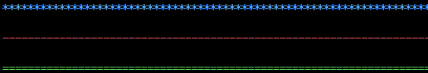
<br clear="left" />

## `title`

```odin
title :: proc(msg: string, char: string = "*", color: string = BLUE)
```

Prints a blank line, a separator, your message, and another separator. Not level-filtered, never written to the log file.

| Parameter | Default | Description |
| --- | --- | --- |
| `msg` | required | The title text. Printed verbatim, no formatting applied, so `%` is safe. |
| `char` | `"*"` | Separator character. |
| `color` | `BLUE` | A package color constant or a raw ANSI escape string. |

```odin
mn.title("Muninn")
mn.title(msg = "Startup", char = "-", color = mn.RED)
mn.title(msg = "Shutdown", char = "=", color = "\x1b[38;5;77m")
```

When color is enabled the message is rendered as `* [ msg ]` in the chosen color.

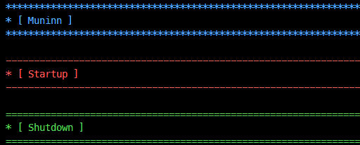
<br clear="left" />

## `Levels`

```odin
Levels :: enum i32 {
	TRACE,
	DEBUG,
	INFO,
	WARN,
	ERROR,
	FATAL,
}
```

Ordered lowest to highest. Setting the level to `.WARN` emits `WARN`, `ERROR` and `FATAL` and drops everything below.

## Color constants

Usable as the `color` argument to `sep` and `title`. Any raw ANSI escape string works too.

| Constant | Code | Used by the logger for |
| --- | --- | --- |
| `RESET` | `\x1b[0m` | Terminating a colored run. |
| `GRAY` | `\x1b[38;5;244m` | `TRACE`, and the location / pid / tid suffix. |
| `BLUE` | `\x1b[38;5;75m` | `DEBUG`, and thread group box frames. |
| `GREEN` | `\x1b[38;5;77m` | `INFO`. |
| `YELLOW` | `\x1b[38;5;221m` | `WARN`, and the stack trace truncation marker. |
| `RED` | `\x1b[38;5;203m` | `ERROR`, and stack trace boxes. |
| `MAGENTA` | `\x1b[38;5;170m` | `FATAL`. |
| `CYAN` | `\x1b[38;5;80m` | Nothing. Free for your own separators and titles. |

## Thread grouping

With `group_by_thread = true`, lines are buffered per thread and printed together inside a labeled box, so a thread pool produces readable runs instead of interleaved noise.

```odin
mn.init(group_by_thread = true, group_max_lines = 25)
```

**Output is deferred.** Nothing appears until a box closes. A box closes when:

- the thread reaches `group_max_lines`
- you call `mn.reset_ctx()` or pass `ctx_reset = true`
- you call `mn.flush()`
- `fatal` is called
- the program exits
- `group_by_thread` is turned back off

Lines wider than the terminal are truncated with an ellipsis rather than tearing the box, and multi-line stack traces are split into one row per line. There is also a hard global ceiling on buffered lines that dumps everything if it is hit; it is a compile-time out-of-memory guard, not a tunable option.

Grouping only affects console output. File output is unbuffered by thread and unaffected. Grouping is skipped entirely when `emit_json` is on.

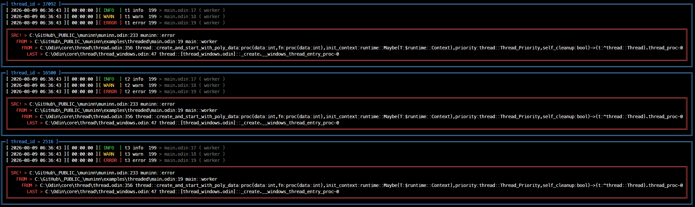
<br clear="left" />

## JSON output and files

When `save_file` is on, every log line is also written as one JSON object per line (JSON Lines). When `emit_json` is on, that same object is printed to stdout instead of the pretty line.

| Field | Type | Description |
| --- | --- | --- |
| `level` | string | `TRACE`, `DEBUG`, `INFO`, `WARN`, `ERROR` or `FATAL`. |
| `timestamp` | string | `YYYY-MM-DD HH:MM:SS` local time. Empty when `show_timestamp` is off. |
| `runtime` | string | `HH:MM:SS` since process start. Empty when `show_runtime` is off. |
| `user` | string | OS username. |
| `file` | string | Full source path. Empty when `show_location` is off. |
| `process_id` | int | Process id. |
| `thread_id` | int | Thread id. |
| `procedure` | string | Calling procedure name. |
| `line` | int | Source line. |
| `column` | int | Source column. |
| `message` | string | The formatted message. |
| `stack` | string[] | Full stack trace, `path:line > procedure`. Populated on `error` and `fatal` in debug builds, otherwise empty. |

The `show_pid` and `show_tid` options only affect the pretty line. `process_id` and `thread_id` are always present in the JSON.

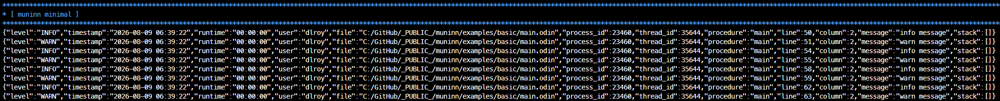
<br clear="left" />

### File naming and rotation

Files are named `<program>__YYYY-MM-DD.jsonl`, where `<program>` is your executable name with the extension stripped. They land in `log_dir`, which defaults to a `.logs` directory next to your executable. The directory tree is created for you.

Rotation runs at normal program exit. It keeps `rotate_days` worth of dated files (today plus the previous `rotate_days - 1` days) and deletes older ones. It only ever touches files in `log_dir` that match your own program's prefix and end in `.jsonl`, so anything else in that directory is left alone. Setting `rotate_days = 0` deletes every previous run's file and keeps only the current one.

Rotation is skipped when `save_file` is off, and when you exit via `os.exit`.

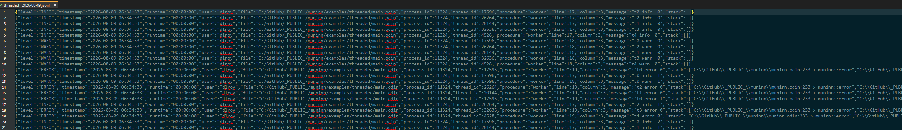
<br clear="left" />

Example of a couple lines from the jsonl file
```json
{
  "level": "WARN",
  "timestamp": "2026-08-09 06:34:33",
  "runtime": "00:00:00",
  "user": "dlroy",
  "file": "C:/GitHub/_PUBLIC_/muninn/examples/threaded/main.odin",
  "process_id": 11324,
  "thread_id": 26264,
  "procedure": "worker",
  "line": 18,
  "column": 3,
  "message": "t2 warn  0",
  "stack": []
}
{
  "level": "ERROR",
  "timestamp": "2026-08-09 06:34:33",
  "runtime": "00:00:00",
  "user": "dlroy",
  "file": "C:/GitHub/_PUBLIC_/muninn/examples/threaded/main.odin",
  "process_id": 11324,
  "thread_id": 17596,
  "procedure": "worker",
  "line": 19,
  "column": 3,
  "message": "t0 error 0",
  "stack": [
    "C:\\GitHub\\_PUBLIC_\\muninn\\muninn.odin:233 > muninn::error",
    "C:\\GitHub\\_PUBLIC_\\muninn\\examples\\threaded\\main.odin:19 > main::worker",
    "C:\\Odin\\core\\thread\\thread.odin:356 > thread::create_and_start_with_poly_data:proc(data:int,fn:proc(data:int),init_context:runtime::Maybe(T:$runtime::Context),priority:thread::Thread_Priority,self_cleanup:bool)->(t:^thread::Thread).thread_proc-0",
    "C:\\Odin\\core\\thread\\thread_windows.odin:47 > thread::[thread_windows.odin]::_create.__windows_thread_entry_proc-0"
  ]
}
```

## Environment variables

Read once at startup, before `main` runs.

| Variable | Effect |
| --- | --- |
| `LOG_LEVEL` | Sets the initial level. Accepts `TRACE`, `DEBUG`, `INFO`, `WARN`, `WARNING`, `ERROR`, `FATAL`, case-insensitive and whitespace-tolerant. Anything unrecognized falls back to `INFO`. |
| `NO_COLOR` | Disables color when set. |
| `FORCE_NO_COLOR` | Disables color when set. |
| `FORCE_COLOR` | Forces color on, overriding both of the above. |

An explicit `init(level = ...)` or `init(use_color = ...)` overrides the environment, since it runs later.

### `muninn.verbose.lock`

If a file named `muninn.verbose.lock` exists in the working directory at startup, the logger hard-sets the level to `TRACE`, ignores `LOG_LEVEL`, and prints its own startup diagnostics: whether saving is enabled, the resolved log directory and path, whether the file handle opened, and whether tracing initialized. Handy for debugging the logger itself or a deployed build you cannot recompile. Though no commonly used... It is more like an artifact from dev, but may help as this continues to advance further.

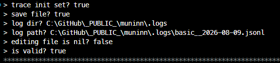
<br clear="left" />

## Lifecycle and thread safety

Setup runs automatically at program start. Cleanup runs automatically on a normal return from `main`: pending thread boxes are printed, the file buffer is flushed, the handle is closed, and rotation runs.

Console and file writes are serialized behind a single mutex, so lines from different threads never interleave mid-line. The log level is stored atomically and can be changed from any thread at any time. **Every other option is a plain global.** Set them with `init` before you spawn threads.

`os.exit`, `abort` and hard crashes skip cleanup. Call `flush` first if you care about the last few lines. `fatal` handles this for you before it panics.

## Limits and gotchas

`emit_json` overrides everything cosmetic. Colors, location suffixes, boxes and grouping are all skipped when it is on.

`group_by_thread` defers output. If your program hangs, the last few lines of the thread that hung may still be sitting in a buffer. Lower `group_max_lines`, call `reset_ctx` at job boundaries, or turn grouping off while you are hunting a deadlock.

Only `level` is safe to reconfigure during a threaded routine. Everything else needs to be set before threads exist.

Stack traces need `-debug`. In release builds `error` and `fatal` still log and still flush, but the trace is empty.

Wrapping the logging procs in your own helper without forwarding `location` will point every line at your wrapper. Pass `location = #caller_location` through.

`context` is block scoped. `context.logger = mn.logger()` inside an `if`, `for` or `do` is thrown away at the closing brace, and `core:log` goes quiet with no error. Attach at the top level of the scope you want it in.
