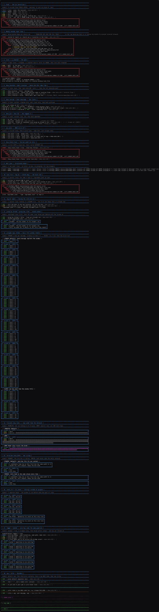

<h1 align="center"><a href="https://github.com/dlroy88osu/Muninn"></a>


<br>
<a href="https://ko-fi.com/U6U81O60FT" target="_blank" rel="noopener noreferrer">
    
</a>

</h1>

# Quick shout out to...
<h4 align="left"><a href="https://odin-lang.org/"></a>
 &nbsp;has been a genuine pleasure to build in, and I am only getting started. I come from a data engineering background, and while I have poked at plenty of other languages, Python has been home for years. This is the first one in a long time that reminded me what "... the Joy of Programming" actually feels like. Here's to you [@gingerBill](https://github.com/gingerBill) and team.
</h4>

---

A zero-ceremony logging package for Odin.

> JUMP TO THE SEXY'S!!!  [DEMO RUN SCREEN CAPTURE](#demo-run)

Colored, aligned console output for humans. JSON Lines on disk for machines. Per-thread output boxes for when a worker pool turns your terminal into confetti. Stack traces on `error` and `fatal`. Log rotation that cleans up after itself. And a one-line bridge to `context.logger`, so a vendored package's output lands in the same place as your own.

> This is "out of the box". No setup call, no config file, nothing to wire up: `import mn "./.."` and start logging. Every option ships with a sane default, and `init` is there for the ones you disagree with.

## See it all in action

The `example/` directory contains a single file that exercises every flag, every proc, and the `core:log` bridge, with a title and explanation before each section:

```
odin run example -debug
```

`-debug` is required for the stack trace sections. Each section resets to a known baseline first, so they are independent — skip to any one you are curious about.

There is also `leak_test/` which wraps `mem.Tracking_Allocator` around the library and runs every path 200 times. It prints a pass/fail report to stderr and writes it to `leak_test.txt`:

```
odin run leak_test -debug
```

Again `-debug` matters: without it `get_trace()` early-returns and the stack-trace sections silently test nothing.

---

## Contents

- [Quick shout out to...](#quick-shout-out-to)
  - [See it all in action](#see-it-all-in-action)
  - [Contents](#contents)
  - [Change Log](#change-log)
  - [Install](#install)
  - [Quick start](#quick-start)
- [Public API](#public-api)
  - [API at a glance](#api-at-a-glance)
  - [`init`](#init)
    - [Parameters](#parameters)
    - [Notes](#notes)
    - [Examples](#examples)
  - [Logging procedures](#logging-procedures)
    - [Level filtering](#level-filtering)
    - [`error` and `fatal` behavior](#error-and-fatal-behavior)
  - [Exit procedure](#exit-procedure)
  - [`core:log` bridge](#corelog-bridge)
    - [`logger`](#logger)
    - [`hooked`](#hooked)
    - [Attach at the top level of a scope](#attach-at-the-top-level-of-a-scope)
    - [Threads](#threads)
    - [Level mapping](#level-mapping)
    - [Bridge notes](#bridge-notes)
  - [`is_enabled`](#is_enabled)
  - [`reset_ctx`](#reset_ctx)
  - [`flush`](#flush)
  - [`sep`](#sep)
  - [`title`](#title)
  - [`Levels`](#levels)
  - [Color constants](#color-constants)
  - [Thread grouping](#thread-grouping)
  - [JSON output and files](#json-output-and-files)
    - [File naming and rotation](#file-naming-and-rotation)
  - [Environment variables](#environment-variables)
    - [`muninn.verbose.lock`](#muninnverboselock)
  - [Lifecycle and thread safety](#lifecycle-and-thread-safety)
  - [Limits and gotchas](#limits-and-gotchas)
- [Private internals](#private-internals)
  - [`Config`](#config)
  - [`State`](#state)
  - [Tuning constants](#tuning-constants)
  - [Internal procedures](#internal-procedures)
  - [Demo Run](#demo-run)
  - [Built with:](#built-with)

---

## Change Log

- 2026.08.001 — Init
- 2026.08.002 — Fixed `context.temp_allocator` usage to shore up leaks. Added `context.logger` bridge.
- 2026.08.003 — Shifted thread grouping from store-and-print-in-bulk to a live rotating window.
- 2026.08.004
  - New `init` flags: `show_stack_trace`, `truncate_long_lines`, `grouped_logs_stream`, `force_box_term_width`.
  - `Config` and `State` structs replace scattered package-level globals — one place for settings, one for runtime state.
  - Logger gets its own persistent allocator (`ST.alloc`) so calls from inside arenas or tracking allocators no longer produce bad-free crashes.
  - Seven memory leaks fixed: `get_trace`, `ansi_truncate`, `ansi_wrap`, `sep`/`title`, and the rotation scratch.
  - `log_dir` path-ownership bug fixed: calling `init(log_dir = ...)` more than once no longer segfaults.
  - `os.file_info_slice_delete` used for rotation cleanup; previously only the slice was freed, leaking every `fullpath` string inside it.
  - `DEFAULT_TEMP_ALLOCATOR_TEMP_GUARD` added to `flush`, `group_reset`, and `cleanup` so temp allocations from those paths are always reclaimed.

---

## Install

Drop the package somewhere in your project and import it:

```odin
import mn "./.."
```

The package has an `@(init)` procedure, so it configures itself the moment your program starts, before `main` runs. On Windows that also flips the console to UTF-8 and enables ANSI escape processing, so the colors and box-drawing characters work in `cmd.exe` and PowerShell without you doing anything.

Stack traces on `error` and `fatal` only exist in debug builds. Compile with `-debug` if you want them.

---

## Quick start

```odin
package main

import mn "./.."

path  := "c:/dev/my_app"
host  := "127.0.0.1"
port  := 22
delay := 15
err   := "This is not good!!!"

main :: proc() {
    mn.init(level = .DEBUG, log_dir = "C:/logs/myapp/app.jsonl")

    mn.title("Muninn")

    mn.trace("cache warm: %d entries", 128)
    mn.debug("config loaded from %s", path)
    mn.info("listening on %s:%d", host, port)
    mn.warn("retrying in %v", delay)
    mn.error("connection dropped: %v", err)

    mn.sep(char = "-", color = mn.GRAY)

    // only if you bail out without returning from main:
    // mn.exit(1)
}
```

---

# Public API

## API at a glance

| Symbol | Kind | Purpose |
| --- | --- | --- |
| `init` | proc | Configure the logger. Every argument is optional. |
| `exit` | proc | Exit the program with flush built in. |
| `trace` `debug` `info` `warn` `warning` `error` `fatal` | proc | Emit a log line. |
| `logger` | proc | Muninn packaged as a `runtime.Logger`, for `context.logger`. |
| `hooked` | proc | Whether a given logger is muninn's. |
| `is_enabled` | proc | Cheap level check before building expensive log arguments. |
| `reset_ctx` | proc | Close the calling thread's pending output box. |
| `flush` | proc | Force buffered file output to disk. |
| `sep` | proc | Print a full-width separator line to the console. |
| `title` | proc | Print a banner: separator, message, separator. |
| `Levels` | enum | `TRACE`, `DEBUG`, `INFO`, `WARN`, `ERROR`, `FATAL`. |
| `RESET` `GRAY` `BLUE` `GREEN` `YELLOW` `RED` `MAGENTA` `CYAN` | constant | ANSI color codes usable with `sep` and `title`. |

## `init`

```odin
init :: proc(
    level:                Maybe(Levels) = nil,
    rotate_days:          Maybe(int)    = nil,
    //
    show_stack_trace:     Maybe(bool)   = nil,
    emit_json:            Maybe(bool)   = nil,
    use_color:            Maybe(bool)   = nil,
    show_location:        Maybe(bool)   = nil,
    show_func:            Maybe(bool)   = nil,
    short_location:       Maybe(bool)   = nil,
    show_runtime:         Maybe(bool)   = nil,
    show_timestamp:       Maybe(bool)   = nil,
    show_pid:             Maybe(bool)   = nil,
    show_tid:             Maybe(bool)   = nil,
    truncate_long_lines:  Maybe(bool)   = nil,
    //
    group_max_lines:      Maybe(int)    = nil,
    group_by_thread:      Maybe(bool)   = nil,
    grouped_logs_stream:  Maybe(bool)   = nil,
    force_box_term_width: Maybe(bool)   = nil,
    //
    log_dir:              Maybe(string) = nil,
    save_file:            Maybe(bool)   = nil,
)
```

Calling `init` is **optional**. The logger works with sane defaults out of the box.

Every parameter is a `Maybe`, so anything you leave off is untouched. Call it once with everything, or call it repeatedly to change one knob at a time.

### Parameters

**Output routing**

| Parameter | Default | Description |
| --- | --- | --- |
| `save_file` | `true` | Write JSON Lines to disk. Toggling this reopens or closes the file handle immediately and flushes whatever was buffered. |
| `log_dir` | `<exe dir>/.logs/<prog>__<date>.jsonl` | Full file path for the `.jsonl` sink. The directory tree is created for you. Changing it flushes and reopens the handle. |
| `rotate_days` | `5` | How many days of logs to keep. Clamped to `>= 0`. Pruning runs at exit. |
| `emit_json` | `false` | Print JSON to stdout instead of the pretty line. Overrides all pretty formatting: colors, boxes, and grouping are skipped entirely. |

**Verbosity**

| Parameter | Default | Description |
| --- | --- | --- |
| `level` | `.INFO` | Minimum level to emit. Anything below is dropped before the message is even formatted. Stored atomically — safe to change from any thread at runtime. |

**Pretty formatting** (all ignored when `emit_json` is `true`)

| Parameter | Default | Description |
| --- | --- | --- |
| `use_color` | auto | ANSI color. Auto-detected at startup from `NO_COLOR` / `FORCE_COLOR` / `FORCE_NO_COLOR`. Pass this to override the detection. |
| `show_location` | `true` | Append `file:line` to each line. |
| `short_location` | `true` | Basename instead of the full path. Requires `show_location`. |
| `show_func` | `true` | Append `( procedure )` to each line. Requires `show_location`. |
| `show_runtime` | `true` | Prepend `[ HH:MM:SS ]` elapsed since process start. |
| `show_timestamp` | `true` | Prepend `[ YYYY-MM-DD HH:MM:SS ]` local wall clock. |
| `show_pid` | `false` | Append the process id. |
| `show_tid` | `false` | Append the thread id. Redundant with `group_by_thread` since the box label already carries it. |
| `show_stack_trace` | `true` | Draw a stack trace box under `error` and `fatal`. Requires a `-debug` build; no-ops silently in release. |
| `truncate_long_lines` | `true` | What to do with a grouped row wider than the terminal. `true` cuts it with an ellipsis so one log line is always one row. `false` wraps it onto as many rows as needed, keeping the full message at the cost of a taller box. Only affects grouped output — ungrouped lines are handed to the terminal as-is. |

**Thread / job grouping** (ignored when `emit_json` is `true`)

| Parameter | Default | Description |
| --- | --- | --- |
| `group_by_thread` | `false` | Collect each thread's lines into a rolling window and reprint the whole window as a labeled box on every message. Turning it **off** flushes anything pending. |
| `group_max_lines` | `50` | How many rows the window holds. |
| `grouped_logs_stream` | `true` | How a full window rotates. `true` (stream): every message sheds the oldest row and reprints the whole window — output appears the instant it is logged, each box is the last N lines. `false` (block): lines accumulate quietly and one box is emitted when the window fills, then it starts over. Far less output per message, but a line can sit in the buffer until the block completes or a flush is forced. |
| `force_box_term_width` | `false` | Pin every box to the full terminal width instead of fitting it to its own longest row. Keeps the rails in the same column down the whole log. Short lines get trailing whitespace. |

### Notes

Call `init` **before you spawn threads**. Every option except `level` is a plain non-atomic field in `CFG`, so reconfiguring while workers are mid-log is a data race.

The file sink is only touched when you pass `log_dir` or `save_file`. Passing formatting options alone never reopens the file.

`use_color` also affects `sep` and `title`, which are not level-filtered and go straight to the console.

Switching `grouped_logs_stream` while `group_by_thread` is on triggers a `flush` first, so the pending window is settled under the old mode rather than being reinterpreted by the new one.

### Examples

```odin
// typical: quiet console, everything on disk
mn.init(level = .DEBUG, log_dir = "C:/logs/myapp/app.jsonl")

// structured output for a log shipper, no files
mn.init(emit_json = true, save_file = false)

// debugging a thread pool - stream rotation, see every message immediately
mn.init(group_by_thread = true, group_max_lines = 25, grouped_logs_stream = true)

// debugging a thread pool - block rotation, one box per completed window
mn.init(group_by_thread = true, group_max_lines = 25, grouped_logs_stream = false)

// force all boxes to the terminal width so the rails line up
mn.init(group_by_thread = true, force_box_term_width = true)

// wrap long lines instead of cutting them
mn.init(group_by_thread = true, truncate_long_lines = false)

// console only, no files at all
mn.init(save_file = false)

// minimal single-line output
mn.init(show_timestamp = false, show_runtime = false, show_pid = false, show_tid = false)

// suppress the stack box on errors (useful for expected / handled errors)
mn.init(show_stack_trace = false)

// bump verbosity later, from anywhere, safely
mn.init(level = .TRACE)
```

## Logging procedures

```odin
trace   :: proc(msg: string, args: ..any, ctx_reset := false, location := #caller_location)
debug   :: proc(msg: string, args: ..any, ctx_reset := false, location := #caller_location)
info    :: proc(msg: string, args: ..any, ctx_reset := false, location := #caller_location)
warn    :: proc(msg: string, args: ..any, ctx_reset := false, location := #caller_location)
warning :: warn   // alias
error   :: proc(msg: string, args: ..any, ctx_reset := false, location := #caller_location)
fatal   :: proc(msg: string, args: ..any, ctx_reset := false, location := #caller_location)
```

| Parameter | Description |
| --- | --- |
| `msg` | The message. When `args` are supplied it is used as a `fmt` format string. With no `args` it is printed verbatim, so stray `%` characters are safe. |
| `args` | Variadic format arguments. |
| `ctx_reset` | Closes the calling thread's pending output box before logging. Runs even if the message is filtered out by level. No-op unless `group_by_thread` is on. |
| `location` | Source location. Defaults to the call site. Pass `location = #caller_location` through if you are wrapping these in your own helpers, so the location points at the real caller. |

```odin
mn.info("server started")
mn.info("bound %s:%d after %v", host, port, elapsed)
mn.debug("worker done", ctx_reset = true)
mn.error("write failed: %v", err)
```

### Level filtering

A call is dropped when its level is below the configured minimum, before the message is formatted, so unused log calls cost almost nothing.

**`fatal` is not filtered.** It ignores the level entirely and always emits.

### `error` and `fatal` behavior

`error` captures a stack trace (in debug builds) and forces an immediate file flush, so the error is on disk even if the process dies right after.

`fatal` does the same, then flushes everything — including all pending thread windows — and **panics** with the formatted message. It does not return.

Stack traces require `-debug`. Without it the trace is empty and the box is not drawn. In the console box the trace is capped at five head frames and five tail frames with a truncation marker in the middle. The `stack` array in the JSON is never truncated.

## Exit procedure

The exit procedure is a simple helper but so you don't have to remember to manually flush

```odin
// these are the same
mn.exit()
mn.exit(0)

// this error code returns
mn.exit(1)

```

## `core:log` bridge

Third-party packages log through `context.logger`. Point that at muninn and everything they emit joins your own lines: same colors, same `file:line ( procedure )` suffix, same level gate, same `.jsonl`, same thread boxes.

One line, at the top level of `main`:

```odin
context.logger = mn.logger()
```

```odin
package main

import "core:log"
import mn "./.."

main :: proc() {
    context.logger = mn.logger()

    log.info("a vendored package logging through core:log")
    mn.info("your own call")
    // identical output, identical file, identical everything
}
```

Muninn does attempt to attach itself in its own `@(init)`, but a procedure cannot write another scope's `context` unless your code opts into `#+feature global-context`. Treat the one-liner as required and use `hooked` if you want to know which happened.

### `logger`

```odin
logger :: proc "contextless" (lowest: runtime.Logger_Level = .Debug) -> runtime.Logger
```

Returns muninn as a plain `runtime.Logger`. `core:log`'s `log.Logger` is an alias of it, so this drops into anywhere a logger is expected.

`lowest` is `core:log`'s own cutoff, applied before it formats the message. Defaults to `.Debug` so everything reaches muninn and the `level` from `init` stays the single source of truth. Raise it only if the formatting cost of dropped messages shows up in a profile.

### `hooked`

```odin
hooked :: proc "contextless" (l: runtime.Logger) -> bool
```

Reports whether a logger is muninn's.

```odin
fmt.println("bridged?", mn.hooked(context.logger))
```

Do not test for `nil` instead. The stock no-op logger has a live `procedure` pointer, so `context.logger.procedure == nil` is `false` even while everything is being silently swallowed.

### Attach at the top level of a scope

`context` is **block** scoped, not procedure scoped. An assignment inside an `if`, `for`, `do`, or a bare `{}` is discarded at the closing brace:

```odin
// WRONG - evaporates at the closing brace
if !mn.hooked(context.logger) {
    context.logger = mn.logger()
}

// RIGHT - top level of the scope you want it in
context.logger = mn.logger()
```

Detach the same way — in your own scope, no unhook proc needed:

```odin
context.logger = {}
```

### Threads

A thread that starts from a fresh context gets the stock no-op logger. Attach at the top of the thread procedure, unconditionally:

```odin
worker :: proc(t: ^thread.Thread) {
    context.logger = mn.logger()

    log.infof("worker %d up", t.user_index)
}
```

Bridged lines group into per-thread boxes exactly like `mn.*` calls do.

### Level mapping

`core:log` has five levels, muninn has six. `TRACE` has no equivalent — `.Debug` is the floor from the `core:log` side.

| `core:log` | muninn | Extra |
| --- | --- | --- |
| `.Debug` | `DEBUG` | |
| `.Info` | `INFO` | |
| `.Warning` | `WARN` | |
| `.Error` | `ERROR` | stack trace, immediate file flush |
| `.Fatal` | `FATAL` | stack trace, immediate file flush |

`log.fatal` does **not** abort; only `log.panic` does. `mn.fatal` still panics.

### Bridge notes

Messages arrive already formatted from `core:log` and are never run through `fmt` a second time. A stray `%` in a vendored log message is safe.

The bridge reuses the same path as `mn.*`, so `is_enabled`, `reset_ctx`, `flush`, `emit_json`, and grouping all behave identically.

A reentrancy guard sits at the front. If anything underneath the logger logs again through `context.logger` (a tracking allocator is the usual culprit), the inner call is dropped rather than recursing into the mutex.

## `is_enabled`

```odin
is_enabled :: #force_inline proc "contextless" (lvl: Levels) -> bool
```

Reports whether a level would actually be emitted. Use it to skip building expensive arguments in hot paths.

```odin
if mn.is_enabled(.DEBUG) do mn.debug("state: %v", expensive_dump())
```

Force-inlined and contextless — safe to call from anywhere.

## `reset_ctx`

```odin
reset_ctx :: proc()
```

Closes the calling thread's pending output window and prints it (or emits the final block, in block mode). No-op when `group_by_thread` is off.

Use it to bracket a unit of work so each job gets its own box:

```odin
worker :: proc(job: Job) {
    mn.info("job %d start", job.id)
    // ...
    mn.info("job %d done", job.id)
    mn.reset_ctx()
}
```

Equivalent to passing `ctx_reset = true` on a logging call, except it does not log anything itself.

## `flush`

```odin
flush :: proc()
```

Settles the open thread window and writes the buffered file output to disk.

File writes are buffered up to 32 KiB. That buffer is flushed automatically on `error`, on `fatal`, when it fills, and at normal program exit. Call it yourself only before a hard exit:

```odin
mn.flush()
os.exit(1)
```

`os.exit` skips the package's exit handler — no flush, no file close, no log rotation. `flush` first.

## `sep`

```odin
sep :: proc(char: string = "*", color: string = BLUE, nl_pre: bool = false, nl_post: bool = false)
```

Prints a full-terminal-width separator line to the console. Not level-filtered, never written to the log file.

| Parameter | Default | Description |
| --- | --- | --- |
| `char` | `"*"` | The character to repeat. |
| `color` | `BLUE` | Any package color constant, or a raw ANSI escape string. Ignored when color is disabled. |
| `nl_pre` | `false` | Blank line before. |
| `nl_post` | `false` | Blank line after. |

```odin
mn.sep()
mn.sep(char = "-", color = mn.RED, nl_pre = true, nl_post = true)
mn.sep(char = "~", color = "\x1b[38;5;208m")   // raw ANSI code, orange
```

Width comes from the terminal, falling back to 80 columns when stdout is not a tty. Takes the same lock as the logger, so a separator can never land in the middle of a log line.


## `title`

```odin
title :: proc(msg: string, char: string = "*", color: string = BLUE)
```

Prints a blank line, a separator, your message, and another separator. Not level-filtered, never written to the log file.

| Parameter | Default | Description |
| --- | --- | --- |
| `msg` | required | The title text. Printed verbatim — `%` is safe. |
| `char` | `"*"` | Separator character. |
| `color` | `BLUE` | A package color constant or a raw ANSI escape string. |

```odin
mn.title("Muninn")
mn.title(msg = "Startup",  char = "-", color = mn.RED)
mn.title(msg = "Shutdown", char = "=", color = "\x1b[38;5;208m")   // raw ANSI
```

When color is enabled the message renders as `* [ msg ]` in the chosen color.


## `Levels`

```odin
Levels :: enum i32 {
    TRACE,
    DEBUG,
    INFO,
    WARN,
    ERROR,
    FATAL,
}
```

Ordered lowest to highest. Setting the level to `.WARN` emits `WARN`, `ERROR`, and `FATAL` and drops everything below.

## Color constants

Usable as the `color` argument to `sep` and `title`. Any raw ANSI escape string works too.

| Constant | Code | Used by the logger for |
| --- | --- | --- |
| `RESET` | `\x1b[0m` | Terminating a colored run. |
| `GRAY` | `\x1b[38;5;244m` | `TRACE`, and the location / pid / tid suffix. |
| `BLUE` | `\x1b[38;5;75m` | `DEBUG`, and thread group box frames. |
| `GREEN` | `\x1b[38;5;77m` | `INFO`. |
| `YELLOW` | `\x1b[38;5;221m` | `WARN`, and the stack trace truncation marker. |
| `RED` | `\x1b[38;5;203m` | `ERROR`, and stack trace boxes. |
| `MAGENTA` | `\x1b[38;5;170m` | `FATAL`. |
| `CYAN` | `\x1b[38;5;80m` | Nothing. Free for your own separators and titles. |

## Thread grouping

With `group_by_thread = true`, each thread's lines are collected into a rolling window and reprinted as a labeled box on every message, so a thread pool produces readable runs instead of interleaved noise.

```odin
mn.init(group_by_thread = true, group_max_lines = 25, grouped_logs_stream = true)
```

**Stream rotation** (`grouped_logs_stream = true`, the default): every message reprints the whole window as a finished box. Once the window is full, the oldest row is shed as each new one arrives, so the box always shows the last N lines. Output appears the instant it is logged — nothing can sit unflushed.

**Block rotation** (`grouped_logs_stream = false`): lines accumulate quietly, and one box is emitted each time the window fills, then the window starts over. Roughly N times less output per run, good for batch jobs and piped output. A line can sit in the buffer until the block completes or a flush is forced.

A box closes (or a partial block is settled) when:

- another thread logs and takes over the open window
- you call `mn.reset_ctx()` or pass `ctx_reset = true`
- you call `mn.flush()`
- `fatal` is called
- the program exits
- `group_by_thread` is turned back off

The box is always drawn in a single pass so all rows and both rails share the same width. In stream mode the right rail steps outward as longer rows arrive. With `force_box_term_width = true`, every box spans the full terminal from the start.

Lines wider than the terminal are truncated by default (`truncate_long_lines = true`). Set it to `false` to wrap them onto as many rows as needed instead — ANSI color state is re-opened on each continuation row.

Grouping only affects console output. File output is not grouped. Grouping is skipped entirely when `emit_json` is on.


## JSON output and files

When `save_file` is on, every log line is also written as one JSON object per line (JSON Lines format). When `emit_json` is on, that object is printed to stdout instead of the pretty line.

| Field | Type | Description |
| --- | --- | --- |
| `level` | string | `TRACE`, `DEBUG`, `INFO`, `WARN`, `ERROR`, or `FATAL`. |
| `timestamp` | string | `YYYY-MM-DD HH:MM:SS` local time. Empty when `show_timestamp` is off. |
| `runtime` | string | `HH:MM:SS` since process start. Empty when `show_runtime` is off. |
| `user` | string | OS username. |
| `file` | string | Full source path. Empty when `show_location` is off. |
| `process_id` | int | Process id. Always present. |
| `thread_id` | int | Thread id. Always present. |
| `procedure` | string | Calling procedure name. |
| `line` | int | Source line. |
| `column` | int | Source column. |
| `message` | string | The formatted message. |
| `stack` | string[] | Full stack trace as `path:line > procedure`. Populated on `error` and `fatal` in debug builds, empty otherwise. Never truncated in JSON. |

`show_pid` and `show_tid` only affect the pretty line. `process_id` and `thread_id` are always present in JSON.


### File naming and rotation

Files are named `<program>__YYYY-MM-DD.jsonl`, where `<program>` is your executable name with the extension stripped. They land in the directory portion of `log_dir`. The directory tree is created for you.

Rotation runs at normal program exit. It keeps `rotate_days` worth of dated files and deletes older ones. It only ever touches files that match your own program's prefix and end in `.jsonl`. Setting `rotate_days = 0` keeps only the current run's file and deletes all previous ones.

Rotation is skipped when `save_file` is off, and when you exit via `os.exit`.

```json
{
  "level": "WARN",
  "timestamp": "2026-08-09 06:34:33",
  "runtime": "00:00:00",
  "user": "dlroy",
  "file": "C:/GitHub/_PUBLIC_/muninn/examples/threaded/main.odin",
  "process_id": 11324,
  "thread_id": 26264,
  "procedure": "worker",
  "line": 18,
  "column": 3,
  "message": "t2 warn  0",
  "stack": []
}
{
  "level": "ERROR",
  "timestamp": "2026-08-09 06:34:33",
  "runtime": "00:00:00",
  "user": "dlroy",
  "file": "C:/GitHub/_PUBLIC_/muninn/examples/threaded/main.odin",
  "process_id": 11324,
  "thread_id": 17596,
  "procedure": "worker",
  "line": 19,
  "column": 3,
  "message": "t0 error 0",
  "stack": [
    "C:\\GitHub\\_PUBLIC_\\muninn\\muninn.odin:308 > muninn::error",
    "C:\\GitHub\\_PUBLIC_\\muninn\\examples\\threaded\\main.odin:19 > main::worker",
    "C:\\Odin\\core\\thread\\thread.odin:356 > thread::create_and_start_with_poly_data:...",
    "C:\\Odin\\core\\thread\\thread_windows.odin:47 > thread::_create.__windows_thread_entry_proc-0"
  ]
}
```

## Environment variables

Read once at startup, before `main` runs.

| Variable | Effect |
| --- | --- |
| `LOG_LEVEL` | Sets the initial level. Accepts `TRACE`, `DEBUG`, `INFO`, `WARN`, `WARNING`, `ERROR`, `FATAL` (case-insensitive). Anything unrecognized falls back to `INFO`. |
| `NO_COLOR` | Disables color when set. |
| `FORCE_NO_COLOR` | Disables color when set. |
| `FORCE_COLOR` | Forces color on, overriding the above two. |

An explicit `init(level = ...)` or `init(use_color = ...)` call overrides the environment, since it runs later.

### `muninn.verbose.lock`

If a file named `muninn.verbose.lock` exists in the working directory at startup, the logger hard-sets the level to `TRACE`, ignores `LOG_LEVEL`, and prints its own startup diagnostics: whether saving is enabled, the resolved log directory and path, whether the file handle opened, and whether tracing initialized. Handy for debugging a deployed build you cannot recompile.

## Lifecycle and thread safety

Setup runs automatically at program start. Cleanup runs automatically on a normal return from `main`: the open thread window is settled, the file buffer is flushed, the handle is closed, and rotation runs.

Console and file writes are serialized behind a single mutex, so lines from different threads never interleave mid-line. The log level is stored atomically and can be changed from any thread at any time. **Every other option is a plain field in `CFG`.** Set them with `init` before you spawn threads.

`os.exit`, `abort`, and hard crashes skip cleanup. Call `flush` first if you care about the last few lines. `fatal` handles this for you before it panics.

## Limits and gotchas

`emit_json` overrides everything cosmetic. Colors, location suffixes, boxes, and grouping are all skipped.

`group_by_thread` defers output in block mode. If your program hangs, the thread that hung may have lines sitting in the window. Lower `group_max_lines`, switch to stream mode, call `reset_ctx` at job boundaries, or turn grouping off while hunting a deadlock.

Only `level` is safe to reconfigure during a threaded run. Everything else needs to be set before threads exist.

Stack traces need `-debug`. In release builds `error` and `fatal` still log and flush, but the trace is empty.

Wrapping the logging procs in your own helper without forwarding `location` will point every line at your wrapper. Pass `location = #caller_location` through.

`context` is block scoped. `context.logger = mn.logger()` inside an `if`, `for`, or `do` is thrown away at the closing brace. Attach at the top level of the scope you want it in.

---

# Private internals

Nothing below this line is part of the public API. It is documented here so contributors and people reading the source are not flying blind — not so you can reach into it.

## `Config`

A single `@(private)` struct holding every user-tunable setting. The package-level `CFG` variable is initialized with the defaults and written only by `init`.

```odin
Config :: struct {
    // verbosity — stored atomically via set_log_level / log_level, must be first for alignment
    level:                Levels,     // default: .INFO
    verbose:              bool,       // default: false

    // output routing
    save_file:            bool,       // default: true
    log_dir:              string,     // default: <exe dir>/.logs/<prog>__<date>.jsonl
    rotate_days:          int,        // default: 5
    emit_json:            bool,       // default: false

    // pretty formatting
    use_color:            bool,       // default: true (auto-detected)
    show_location:        bool,       // default: true
    show_func:            bool,       // default: false
    short_location:       bool,       // default: true
    show_runtime:         bool,       // default: true
    show_timestamp:       bool,       // default: true
    show_pid:             bool,       // default: false
    show_tid:             bool,       // default: false
    show_stack:           bool,       // default: true
    truncate_long_lines:  bool,       // default: true

    // thread / job grouping
    group_by_thread:      bool,       // default: false
    group_max_lines:      int,        // default: 50
    grouped_logs_stream:  bool,       // default: true
    force_box_term_width: bool,       // default: false
}
```

## `State`

A single `@(private)` struct holding all runtime state. Never touch it from outside the package.

```odin
State :: struct {
    // process identity — set once in @(init), read-only after
    user:         string,
    prog_name:    string,
    started:      time.Time,
    proc_id:      int,

    // file sink — guarded by log_mutex
    log_path:     string,
    editing_file: ^os.File,
    file_buf:     strings.Builder,

    // grouping window — guarded by log_mutex
    group_tid:    int,             // owning thread, -1 = empty
    group_win:    [dynamic]string, // rows oldest-first

    // the logger's own heap allocator. deliberately NOT context.allocator:
    // init() can be called from inside an arena or tracking allocator,
    // and the wrong allocator at free time means a bad-free crash.
    alloc:        runtime.Allocator,

    // stack traces — guarded by trace_mutex
    trace_ctx:    trace.Context,

    // synchronization
    log_mutex:    sync.Mutex,
    time_mutex:   sync.Mutex,
    trace_mutex:  sync.Mutex,
    init_once:    sync.Once,
}
```

## Tuning constants

Compile-time limits. Changing these means recompiling and knowing why.

| Constant | Value | Meaning |
| --- | --- | --- |
| `FLUSH_AT` | `32 * 1024` | File buffer bytes before an automatic flush. |
| `LINE_CAP` | `4096` | Hard ceiling on one formatted JSON line. Overflow is silently dropped — the JSON writer's nil-allocator builder refuses to grow. |
| `MSG_CAP` | `2048` | Hard ceiling on one message body in the pretty path. |
| `TAIL_RESERVE` | `48` | Bytes held back inside `LINE_CAP` so the JSON tail (`"stack":[],"truncated":true}`) is always writable. |
| `DEFAULT_WIDTH` | `80` | Terminal column count assumed when stdout is not a tty. |
| `TRACE_HEAD` | `5` | Stack frames shown at the top of a truncated trace. |
| `TRACE_TAIL` | `5` | Stack frames shown at the bottom of a truncated trace. |
| `TRACE_MAX` | `TRACE_HEAD + TRACE_TAIL` | Total frames shown when a trace is truncated. |

## Internal procedures

All `@(private)`. Listed here for orientation when reading the source.

| Procedure | Purpose |
| --- | --- |
| `central_log` | The single entry point that formats, gates, and dispatches every log line. |
| `_init` | `@(init)` — runs before `main`. Enables UTF-8 / ANSI on Windows, detects color, sets default paths. |
| `cleanup` | `@(fini)` — runs on normal exit. Settles the group window, flushes, closes the file handle, runs rotation. |
| `validate_requirements` | Run once via `sync.Once` on the first log call. Initializes `ST.group_win` and validates the file sink. |
| `rebuild_log_path_locked` | Clones the new path and dir into `ST.alloc`, frees the old ones, and reopens the file handle. |
| `reopen_file_locked` | Flushes and closes any open handle, then opens a new one if `save_file` is on. |
| `flush_locked` | Writes `ST.file_buf` to disk and resets it. Must hold `log_mutex`. |
| `group_push_locked` | Pushes a new row into the window; in stream mode reprints the window, in block mode emits and clears when full. |
| `group_box_locked` | Builds and writes one complete box for a slice of rows. |
| `group_close_locked` | Settles the open window: emits a partial block if in block mode, then clears. |
| `group_drop_locked` | Frees all rows in the window without printing. |
| `group_close_one_locked` | Calls `group_close_locked` only if the given tid owns the window. |
| `group_flush_locked` | Alias for `group_close_locked`; called from `flush` and `cleanup`. |
| `group_reset` | Public-facing wrapper: takes `log_mutex` and calls `group_close_one_locked`. |
| `get_trace` | Captures and formats a stack trace box string and a `[]string` for JSON. All scratch on `context.temp_allocator`. |
| `ansi_width` | Visible column count of a string, skipping ANSI escape sequences. |
| `ansi_truncate` | Cuts a string to `max_vis` visible columns and appends `…`. |
| `ansi_wrap` | Splits a string into chunks of `max_vis` columns, re-opening active ANSI state on each chunk. |
| `clamp_str` | Byte-clamps a string to `n` bytes without splitting a UTF-8 sequence. |
| `get_term_width` | Reads the terminal width via `GetConsoleScreenBufferInfo` (Windows) or `ioctl TIOCGWINSZ` (Unix). |
| `repeat` | Fills the terminal width with a character. |
| `timestamp` | Formats the current wall time or a past date into a caller-supplied buffer via `libc.strftime`. |
| `jw_*` | A small family of inline JSON-writer helpers that write into a fixed-size stack buffer and track truncation. |
| `set_log_level` / `log_level` | Atomic read/write for `CFG.level`. |
| `thread_id` | Thread-local cache for `sync.current_thread_id()`. |
| `env_is_set` / `get_env_string` | Environment variable helpers using a stack buffer to avoid heap allocations at init time. |
| `level_from_runtime` | Maps `runtime.Logger_Level` to `Levels` for the `core:log` bridge. |
| `context_logger_proc` | The bridge procedure stored in `runtime.Logger`. Routes `core:log` calls into `central_log`. |
| `_hook_context_logger` | `@(init)` attempt to attach under `#+feature global-context`. |


## Demo Run

<br clear="left" />>

---

## Built with:

<h1 align="center"><a href="https://odin-lang.org/"></a>
